FastAPI + SQLAlchemy + SQLite로 만든 챗봇 서버. 일반적인 챗봇처럼 대화가 한 줄로만 쌓이는 게 아니라, 메시지를 git처럼 트리(tree) 구조로 저장해서 대화 중 어느 지점에서든 새로운 "가지(branch)"를 만들어 다른 방향으로 이어갈 수 있다.


## 아키텍처
```
router.py     API 엔드포인트
   ↓
service.py    비즈니스 로직 (LLM 호출)
   ↓
repository.py DB CRUD
   ↓
models.py     테이블 정의
database.py   DB 연결 / 세션
```

## DB 구조
| 테이블 | 설명 |
|---|---|
| `conversations` | 대화방(세션) 하나. 제목, 생성 시각 |
| `branches` | 한 대화방 안의 가지. `head_id`가 그 가지의 현재 끝 메시지를 가리킴 (git HEAD와 같은 개념) |
| `messages` | 메시지 한 개. `parent_id`로 이전 메시지를 가리켜 트리 구조를 이룸 |

대화방을 만들면 기본 가지인 `main`이 함께 생성된다. 특정 메시지 지점에서 `POST /branches`를 호출하면 그 지점부터 갈라지는 새 가지가 만들어지고, 이후 그 가지로 보낸 메시지는 다른 가지와 섞이지 않는다.

## API 엔드포인트
| 메서드 | 경로 | 설명 |
|---|---|---|
| GET | `/health` | 헬스체크 |
| POST | `/sessions` | 새 대화방 + main 가지 생성 |
| GET | `/sessions` | 대화방 목록 (사이드바용) |
| GET | `/sessions/{session_id}/branches` | 한 대화방의 가지 목록 |
| POST | `/branches` | 특정 메시지 지점(`from_message_id`)에서 새 가지 생성 |
| GET | `/branches/{branch_id}/thread` | 그 가지의 현재 대화 줄기 (화면 표시용) |
| POST | `/chat` | `branch_id`로 메시지 전송 → AI 응답을 그 가지의 head에 이어붙임 |
| GET | `/chat/history` | (구버전) session_id 기준 전체 메시지 조회 |

## 실행 방법
```cmd
# 가상환경 활성화 후
pip install -r requirements.txt

# .env 파일에 OPENAI_API_KEY=sk-... 작성

uvicorn main:app --reload
```

서버가 뜨면 `http://127.0.0.1:8000/docs`에서 Swagger UI로 테스트 가능.

## 사용 흐름 예시
1. `POST /sessions` → 대화방 + main 가지 생성, `main_branch_id` 받음
2. `POST /chat` (`branch_id`=main, `message`="...") → AI 응답
3. 특정 메시지에서 다른 방향으로 시도해보고 싶으면 `POST /branches` (`from_message_id`=그 메시지 id)로 새 가지 생성
4. 새 `branch_id`로 `POST /chat` 호출 → main과 별개로 이어지는 대화

------------------
## swagger ui로 api 동작시켜보기
#### 1.
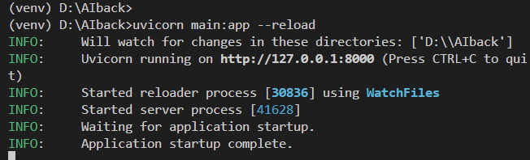
<br><span style="font-size:18px">터미널에 uvicorn main:app --reload치기</span>

#### 2.
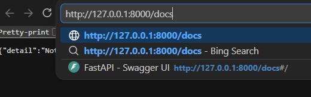

#### 3.
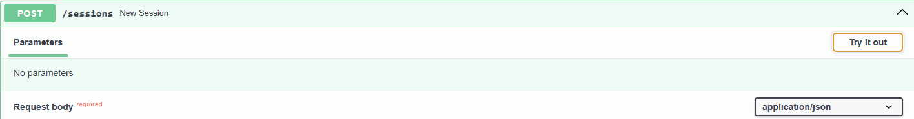
<br><span style="font-size:18px">try it out 누르기 -&gt; 파라미터 있으면 적고 execute</span>

#### 4.
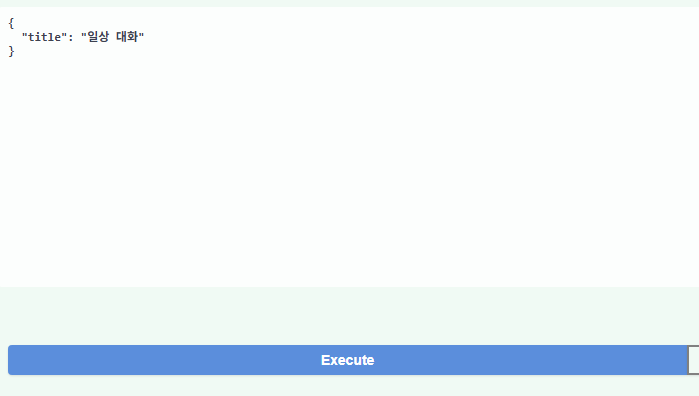

#### 5.
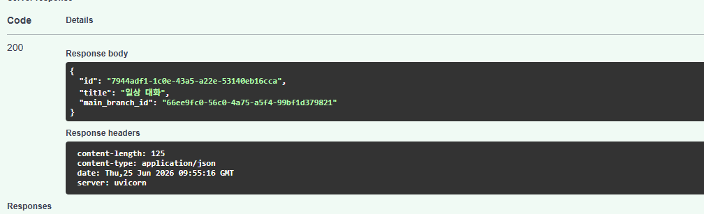
<br><span style="font-size:18px">맨위에가 세션 아이디 아래가 브랜치 아이디(기본 브랜치 이름은 main임)</span>

#### 6.
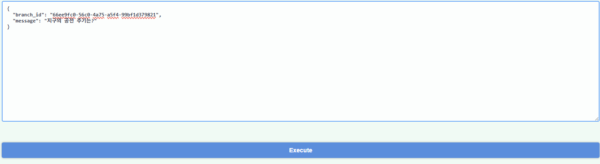
<br><span style="font-size:18px">chat에 브랜치아이디 복붙,질문 암거나</span>

#### 7.
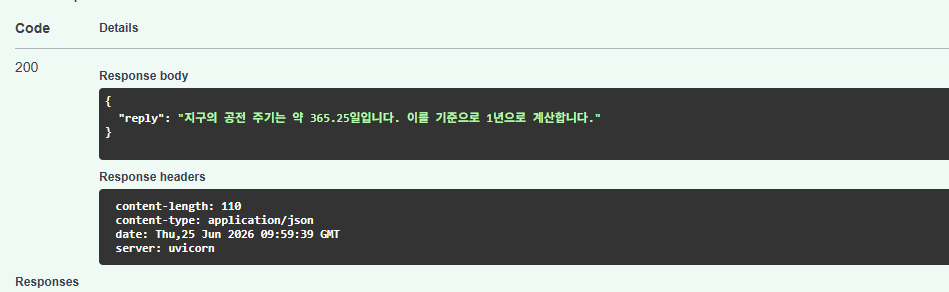

#### 8.
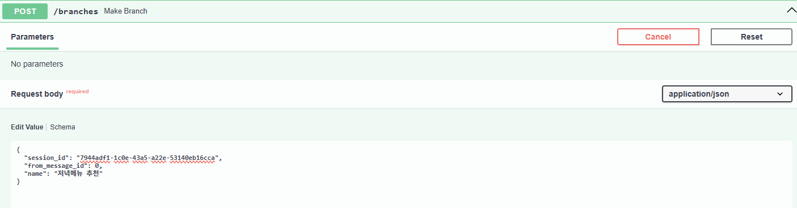

#### 9.
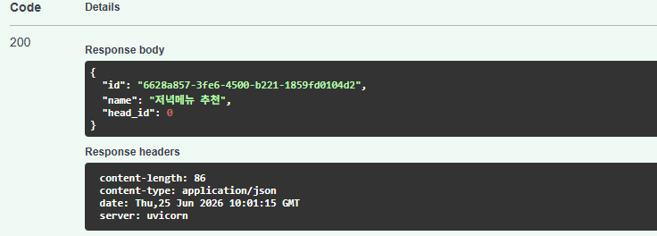
<br><span style="font-size:18px">새로운 브랜치 아이디 획득<br>브랜치 아이디 복사해두기</span>

#### 10.
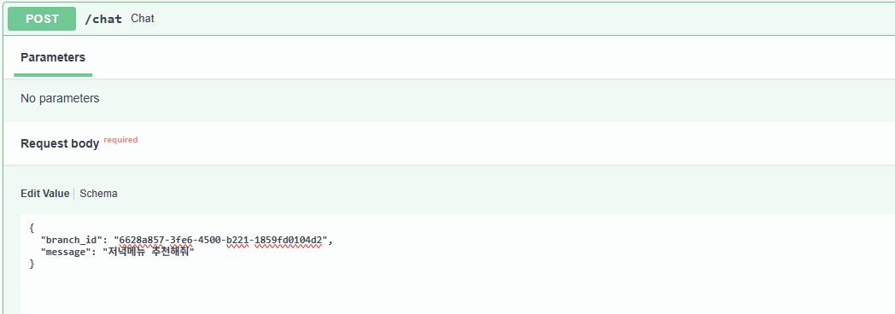
<br><span style="font-size:18px">복사한 브랜치 아이디로 질문</span>

#### 11.
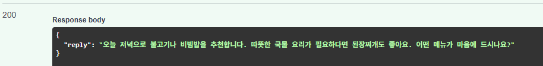

#### 12.
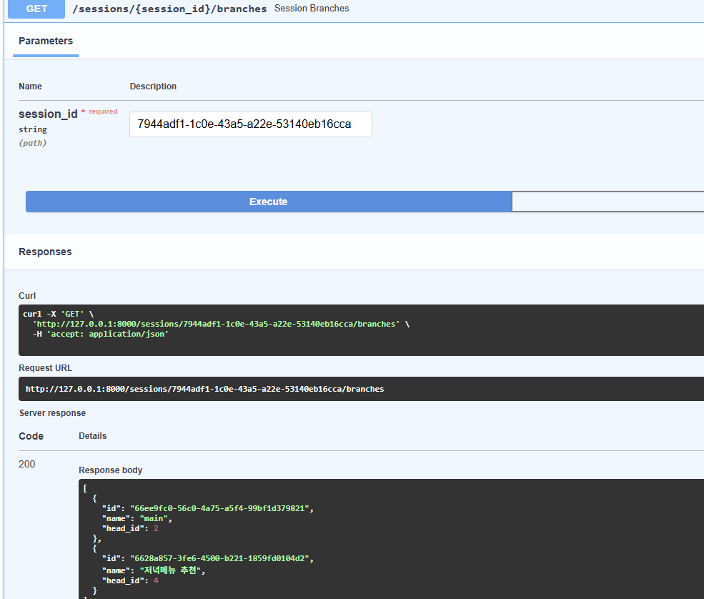
<br><span style="font-size:18px">한세션에 두 브랜치 생성</span>